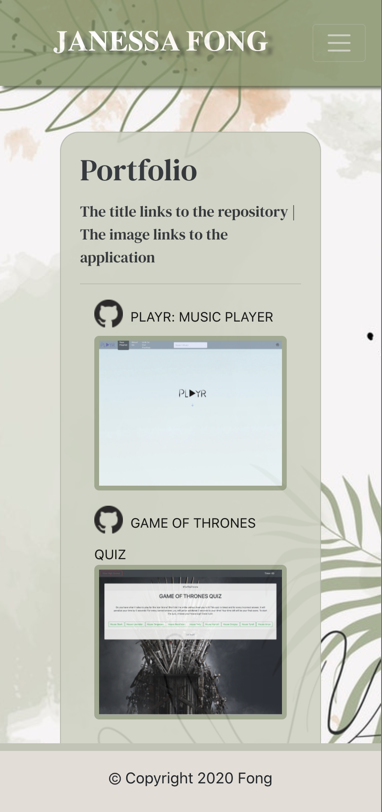
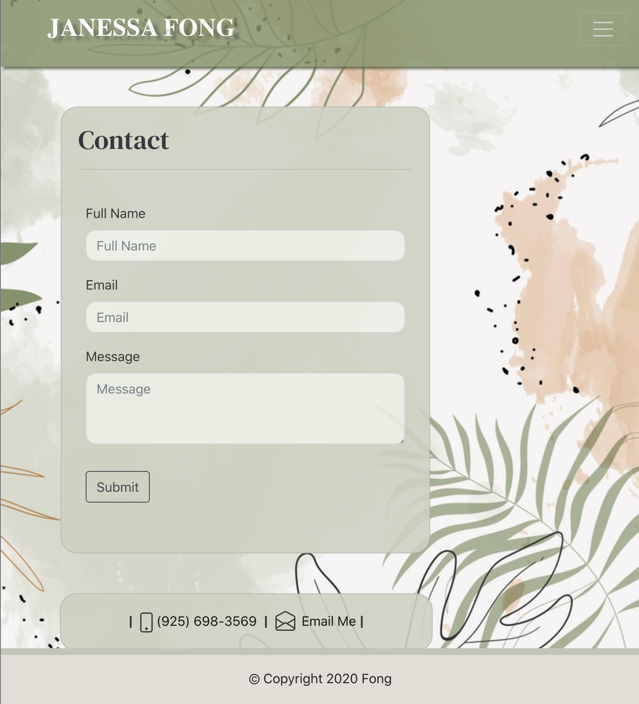
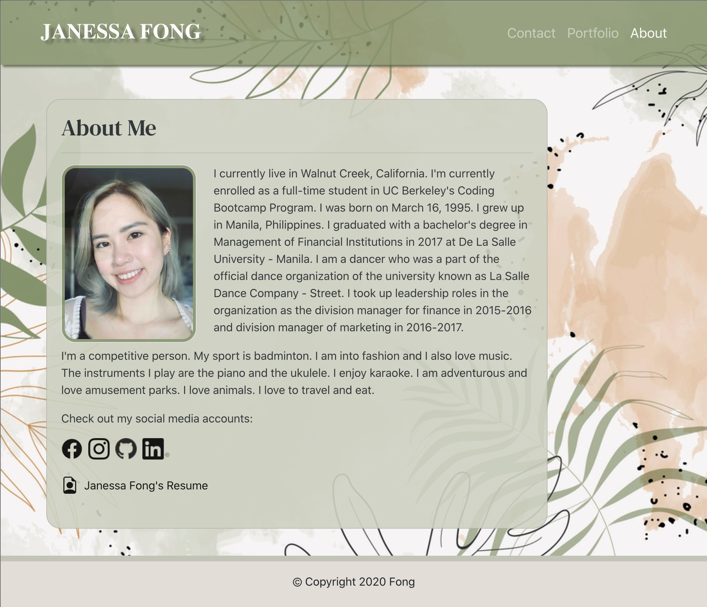

# React To My Portfolio

In this project, I've created a functional and responsive portfolio utilizing the Bootstrap CSS Framework as well as utilizing the Bootstrap grid system so that the website and its layouts function on different devices and browsers. This project is all about consistency and functionality. I've turned this project into a react application! I have utilized AOS, a package that allows animation to my pages. I have also installed a package called emailjs which allows users to fill up the contact form and is directly linked to my email.

This project was a great way to add personality to your own portfolio for future collaborations and to showcase projects. It's a great way to witness and document the journey in becoming a master coder but for now, I am still a master coder in training and this is a way to see the process unfold and my growth in this program. This is a gateway to the real world, in this case, the tech world to prepare each one of us and push us to move forward and pave the way into our careers.

Challenges I've faced, deciding on how I wanted to approach this react portfolio was difficult. There are so many ways on how to build the application and so it got a little bit overwhelming. There were certain ways I wanted to do but honestly did not know how to since I'm still adjusting on how to use react and with the time constraint, I couldn't look up more into it. I did want to separate more components to breakdown the application more but as I mentioned, I couldn't get it right and the deadline was approaching. I do like the changes I've made and the ease of it to make those changes because you didn't have to change every page if there are specific components that are consistent for each page.


## Table of Contents

* [Features](#features)
* [Technologies Used](#technologies-used)
* [GIF of Project](#gif-of-project)
* [Images of Project](#images-of-project)
* [Deployed Link](#deployed-link)
* [Authors](#authors)
* [License](#license)
* [Acknowledgments](#acknowledgments)

## Features

This project has a number of features including:

* A navbar with functional links

    This navbar contains my name which set to the homepage and the names of the other pages of my application which are: About, Contact and Portfolio.

* Main content

    * About Me

        In the about page, adding a card title as your base while utilizing the bootstrap grid system and attaching an image, a short paragraph about myself and links to my social media accounts and in this case, I utilized the logos that will direct you to my social media accounts.

    * Portfolio
    
        In this portfolio page, with the projects I've worked on, I have added images/gifs into the card. Each image is clickable so that it could take you to the application. They each have a github logo and a project title that links to my github repository.

    * Contact

        In this page, this was built again in a card title and added a form to be filled out by anyone who would like to reach out. There is an included email service I've installed so that I could recieve notifications from users. 

    * A sticky footer

        This feature was a tricky one. I did attempt a sticky footer and it worked except at a certain screen size moved a little bit away from the bottom of the page so I have attempted instead to use the fixed feature. 

## Technologies Used

* [HTML](https://developer.mozilla.org/en-US/docs/Web/HTML)
* [Bootstrap](https://getbootstrap.com/)
* [React.js](https://reactjs.org/)
* [Javascript](https://developer.mozilla.org/en-US/docs/Web/JavaScript)
* [JSX](https://reactjs.org/docs/introducing-jsx.html)
* [CSS](https://developer.mozilla.org/en-US/docs/Web/CSS)
* [Email.js](https://www.emailjs.com/)
* [AOS](https://michalsnik.github.io/aos/)
* [AOS](https://reactrouter.com/web/guides/quick-start)


## GIF of Project


## Images of Project

Attached below are screenshots in their screen sizes 400px, 768px, and 992px, respectively.





## Code Snippet

I've chosen this code snippet because I have a Project component that I am exporting to be used in my Portfolio page and this is mapping through the Projects.json file I've made containing information on the projects I've worked on. Importing it into this Project component, I am going through each project and setting the values onto the respective tags on how I chose to layout my page.

```
 <React.Fragment>
    {Projects.map(project => {
        return(
            <>
            <div className="col-lg-6">
                <a 
                href={project.githubURL} 
                target="_blank"
                rel="noreferrer"
                className="mb-3 text-center githubLink">   
                    
                    {project.title}
                </a>
                <a 
                href={project.appURL} 
                target="_blank"
                rel="noreferrer"
                className="mb-3 pt-3">
                    
                </a>
            </div>
            <div className="row mb-4 mr-1"></div>
            </>
        );
    })};
</React.Fragment>
```

## Deployed Link

* [See Live Site](https://janessaref.herokuapp.com/)


## Authors

* Janessa Reeanne Fong

- [Link to Github](https://github.com/janessaref)
- [Link to LinkedIn](https://www.linkedin.com/in/janessafong)
- [Link to Portfolio](https://janessaref.herokuapp.com/)

## License

This project is licensed under the MIT License 

## Acknowledgments

* I'd like to acknowledge my tutor Andrew Knapp.
* To my mentors and instructors, Jerome Chenette, Mahisha Gunasekaran, and Manuel Nunes for helping and teaching me throughout this program.